 

    
    <h2 style="font-size: 30px">F1 Database</h2>
    
M3 Race

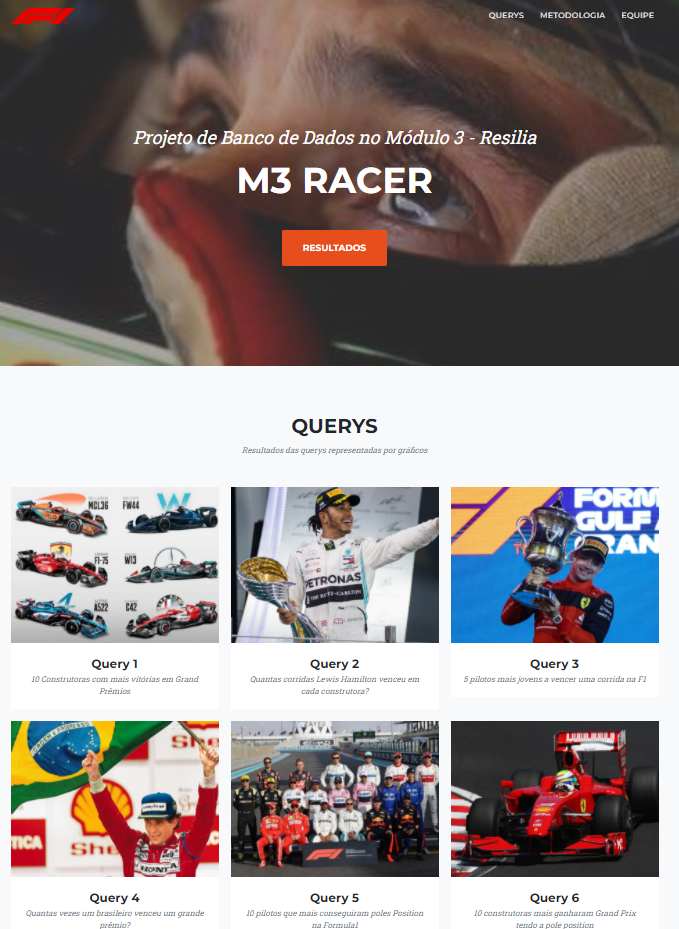

  

# 🔖 Descrição

O projeto teve como objetivo a manipulação de um bando de dados, o software utilizado para gerenciamento dos dados foi o MySQL, a partir das informações fornecidas no banco de dados, 10 perguntas foram elaboradas, os resultados foram apresentados por meio de gráficos.

Na organização da equipe foi aplicado a metodologia ágil SCRUM, e na divisão das tarefas foi utilizado o método KANBAN com ferramenta Trello.

Para a demonstração detalhada das perguntas, gráficos e análises, foi desenvolvido um site em HTML, Bootstrap, CSS e JS.

Link de referência com os dados atualizados: <a href="https://www.kaggle.com/datasets/rohanrao/formula-1-world-championship-1950-2020" style="font-size: 16px">clique aqui!</a>

<strong>Para acessar o Page:</strong> <a href="https://1995william.github.io/Projeto-M3/" style="font-size: 20px">clique aqui!</a>

  

# 📋 Perguntas e Querys

<ol style="line-height:370%">
    <li style="font-size: 20px"> 10 Construtoras com mais vitórias em Grand Prêmios?</li>
 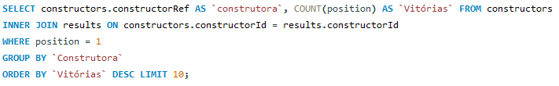
    <li style="font-size: 20px">Quantas corridas Lewis Hamilton venceu em cada construtora?</li>
    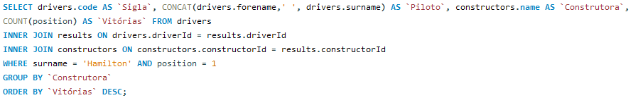
    <li style="font-size: 20px">5 pilotos mais jovens a vencer uma corrida na F1?</li>
    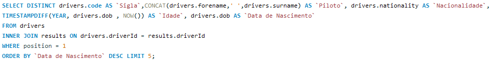
    <li style="font-size: 20px">Quantas vezes um brasileiro venceu um grande prêmio?</li>
    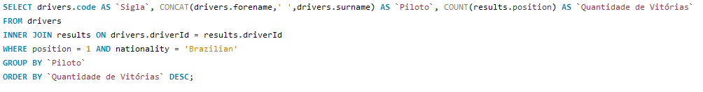
    <li style="font-size: 20px">10 pilotos que mais conseguiram pole Position na F1?</li>
    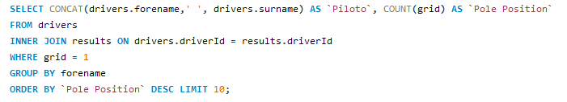
    <li style="font-size: 20px">10 Construtoras mais ganharam Grand Prix tendo a pole position?</li>
    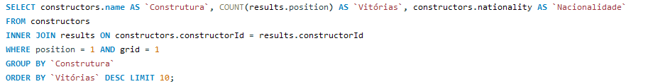
    <li style="font-size: 20px">Quais as nacionalidade com maior quantidade de vitorias?</li>
    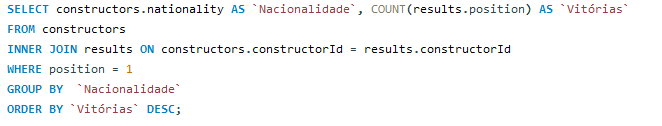
    <li style="font-size: 20px">10 pilotos que mais subiram no pódio (1,2,3 colocação)?</li>
    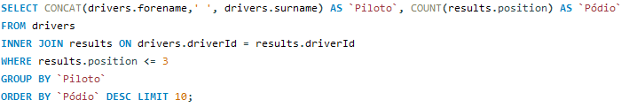
    <li style="font-size: 20px">5 consturtoras que sofreram mais acidentes na F1?</li>
    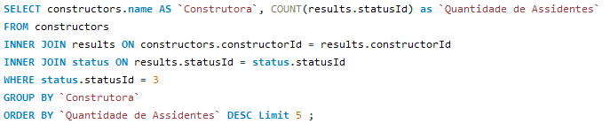
    <li style="font-size: 20px">5 Grand Prix com maior velocidade de veiculo na F1?</li>
    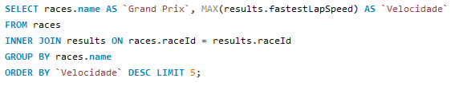
</ol>

  

# 📑 Relacionamento das entidades

    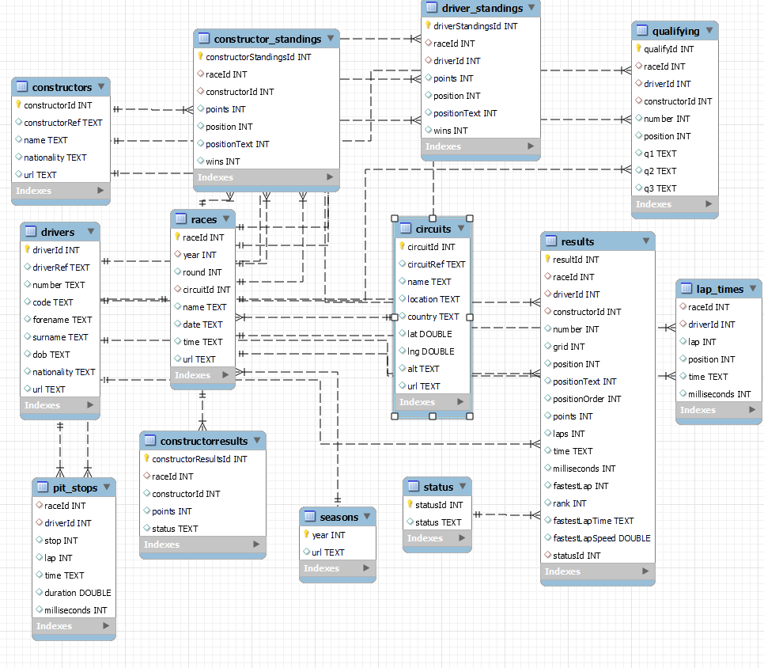

  

# 📝 Trello

    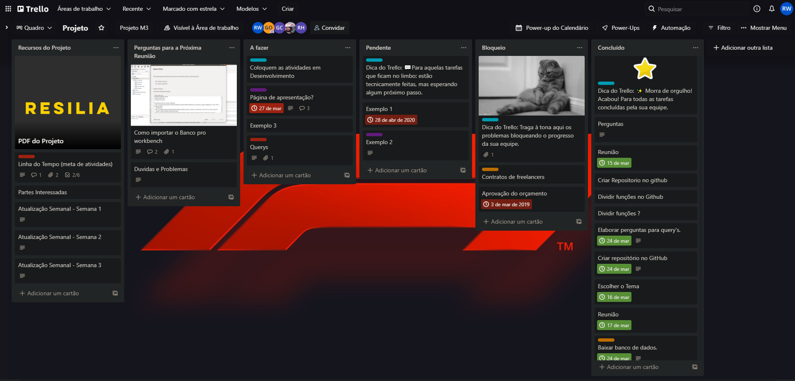

  

# 🔧 Tecnologias e ferramentas utilizadas

 

  

# 🐝 Time de desenvolvimento

 
<ul>
    <li style="font-size:21px">Guilherme Carvalho</li>
    <li style="font-size:21px">Guilherme Santiago</li>
    <li style="font-size:21px">Jocélia da Hora</li>
    <li style="font-size:21px">Rafael Henrique</li>
    <li style="font-size:21px">Rodrigo William</li>
</ul>
 
